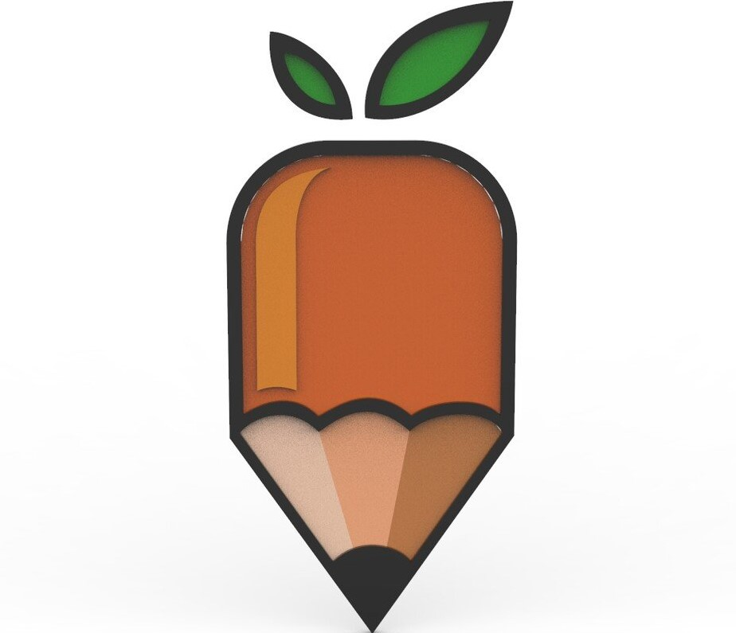
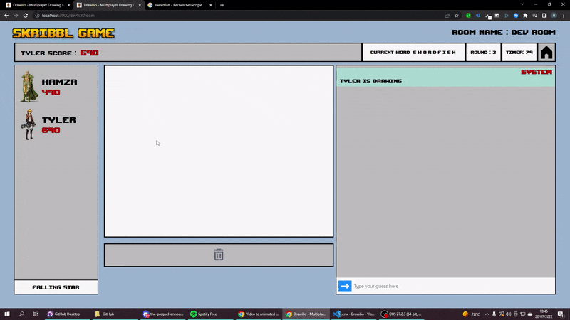

<div id="top"></div>

<!-- PROJECT SHIELDS -->
<!--
*** I'm using markdown "reference style" links for readability.
*** Reference links are enclosed in brackets [ ] instead of parentheses ( ).
*** See the bottom of this document for the declaration of the reference variables
*** for contributors-url, forks-url, etc. This is an optional, concise syntax you may use.
*** https://www.markdownguide.org/basic-syntax/#reference-style-links

[![Contributors][contributors-shield]][contributors-url]
[![Forks][forks-shield]][forks-url]
[![Stargazers][stars-shield]][stars-url]
[![Issues][issues-shield]][issues-url]
[![MIT License][license-shield]][license-url]
[![LinkedIn][linkedin-shield]][linkedin-url]
-->

<!-- PROJECT LOGO -->
<br />
<div align="center">
  <a href="https://github.com/Hamziss/Skribblio-Front">
    
  </a>

  <h3 align="center">Drawilio</h3>

  <p align="center">
    A Multiplayer Draw and guess game !
    <br />
    <a href="https://github.com/Hamziss/Skribblio-Front"><strong>Explore the docs »</strong></a>
    <br />
    <br />
    <a href="https://drawilio.netlify.app/">View Demo</a>
    ·
    <a href="https://github.com/Hamziss/Drawilio/issues">Report Bug</a>
    ·
    <a href="https://github.com/Hamziss/Drawilio/issues">Request Feature</a>
  </p>
</div>

<!-- TABLE OF CONTENTS -->
<details>
  <summary>Table of Contents</summary>
  <ol>
    <li>
      <a href="#about-the-project">About The Project</a>
      <ul>
        <li><a href="#built-with">Built With</a></li>
      </ul>
    </li>
    <li>
      <a href="#getting-started">Getting Started</a>
      <ul>
        <li><a href="#prerequisites">Prerequisites</a></li>
        <li><a href="#installation">Installation</a></li>
      </ul>
    </li>
   
  </ol>
</details>

<!-- ABOUT THE PROJECT -->

## About The Project



Drawilio is a drawing multiplayer game that you can play with your friends :smile:.

<p align="right">(<a href="#top">back to top</a>)</p>

### Tech Stack used

- [React.js](https://reactjs.org/)
- [socket.io](https://socket.io/)
- [Node](https://nodejs.org/en/)
- [Express](https://expressjs.com/fr/)
- [Redis](https://redis.io/)

<p align="right">(<a href="#top">back to top</a>)</p>

<!-- GETTING STARTED -->

## Getting Started

To get a local copy up you have to first create a cluster in redis cloud .

### Prerequisites


- npm
  ```sh
  npm install npm@latest -g
  ```

### Installation


1. Clone the repo
   ```sh
   git clone https://github.com/Hamziss/Drawilio.git
   ```
3. Install NPM packages inside Drawilio-Api and Drawilio-Front
   ```sh
   npm install
   ```
4. Enter this env variables in `.env`
   ```
   REACT_APP_API_URL=http://localhost:5000/
   PORT=5000
   REDIS_ENDPOINT_URI= your redis endpoint uri
   REDIS_PASSWORD= your redis cluster password
   ```
5. start the server and the front with two terminal by running :
   ```
   npm start
   ```
<p align="right">(<a href="#top">back to top</a>)</p>


<!-- CONTRIBUTING -->

## Contributing

Contributions are what make the open source community such an amazing place to learn, inspire, and create. Any contributions you make are **greatly appreciated**.

If you have a suggestion that would make this better, please fork the repo and create a pull request. You can also simply open an issue with the tag "enhancement".
Don't forget to give the project a star! Thanks again!

1. Fork the Project
2. Create your Feature Branch (`git checkout -b feature/AmazingFeature`)
3. Commit your Changes (`git commit -m 'Add some AmazingFeature'`)
4. Push to the Branch (`git push origin feature/AmazingFeature`)
5. Open a Pull Request

<p align="right">(<a href="#top">back to top</a>)</p>

<!-- LICENSE -->

## License

Distributed under the MIT License. See `LICENSE.txt` for more information.

<p align="right">(<a href="#top">back to top</a>)</p>


<!-- MARKDOWN LINKS & IMAGES -->
<!-- https://www.markdownguide.org/basic-syntax/#reference-style-links -->

[contributors-shield]: https://img.shields.io/github/contributors/othneildrew/Best-README-Template.svg?style=for-the-badge
[contributors-url]: https://github.com/Hamziss/Drawilio/graphs/contributors
[forks-shield]: https://img.shields.io/github/forks/othneildrew/Best-README-Template.svg?style=for-the-badge
[forks-url]: https://github.com/Hamziss/Drawilio/network/members
[stars-shield]: https://img.shields.io/github/stars/othneildrew/Best-README-Template.svg?style=for-the-badge
[stars-url]: https://github.com/Hamziss/Drawilio/stargazers
[issues-shield]: https://img.shields.io/github/issues/othneildrew/Best-README-Template.svg?style=for-the-badge
[issues-url]: https://github.com/Hamziss/Drawilio/issues
[license-shield]: https://img.shields.io/github/license/othneildrew/Best-README-Template.svg?style=for-the-badge
[license-url]: https://github.com/Hamziss/Drawilio/blob/master/LICENSE.txt
[linkedin-shield]: https://img.shields.io/badge/-LinkedIn-black.svg?style=for-the-badge&logo=linkedin&colorB=555
[linkedin-url]: https://linkedin.com/in/othneildrew
[product-screenshot]: images/screenshot.png
